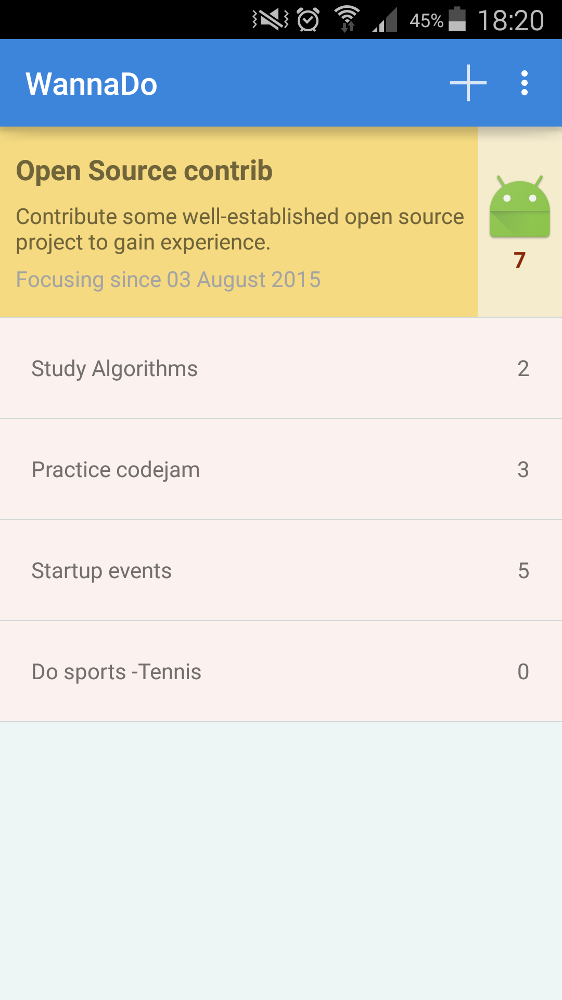
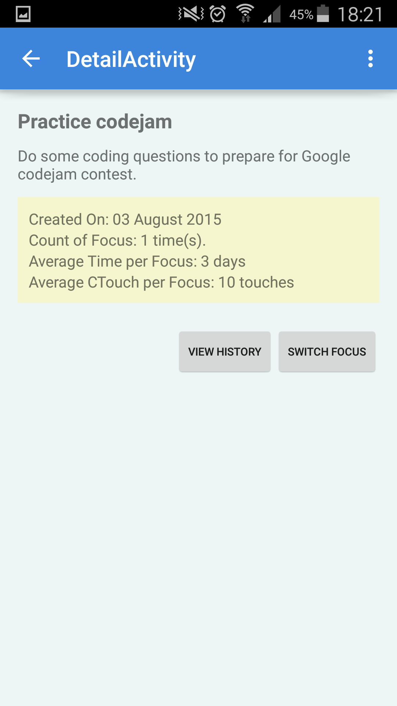

#WannaDo Android App

As a learning expereince, I created this app to understand concepts in Android development. The motivation is I need some form of list that keeps reminding me of what I want to do in a certain period. For example, I am happy when I have multiple things to do in my mind but sometimes I have to focus on one. With this app, I can create a list of those things I am interested and keep a focus. While focusing on one activity, I can touch the counter to remind myself of how much I have been doing that activity. By clicking one activity, I can see the detail information and some basic statistics. In addition the history of the activity will be shown per request (by clicking View History).

##Screenshots

Some screenshots of the app are shown below. You can see the "Open Source Contribution" activity has more attention (7 times) among the activities and "Do Sport" has no count at all (no wonder I get fat lol). Individual view of an activity will display basic statistics about that acitvity.

<table>
    <tr>
        <td>
            
            
List of Activities

        </td>
        <td>
            
            
Focused Activity

        </td>
        <td>
            
            
Other Activity

        </td>
        <td>
            
            
New Activity

        </td>
    </tr>
</table>
